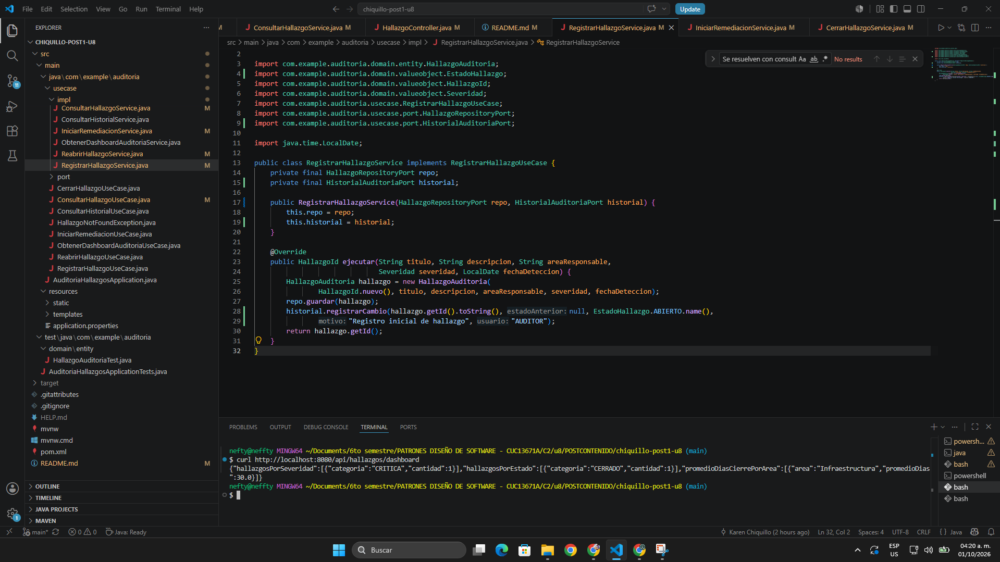
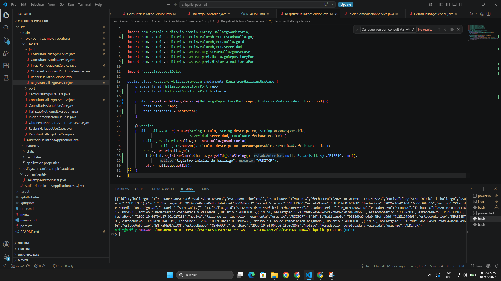

# Post-contenido — Unidad 8: Patrones Arquitectónicos II

## Descripción
Repositorio del post-contenido de la Unidad 8 de Patrones de Diseño de Software — Sexto Semestre. Sistema de seguimiento de hallazgos de auditoría interna implementado con **Clean Architecture** (Parte 1) y extendido con un dashboard consolidado de métricas y una bitácora de trazabilidad de cambios de estado (Parte 2) en un único proyecto Spring Boot.

---

## Parte 1 — Clean Architecture (Hallazgos de Auditoría Interna)
El proyecto organiza el código en los cuatro círculos concéntricos de Clean Architecture. La dependencia del código siempre apunta hacia adentro, hacia `domain/`.

- **Entities (`domain/`):** reglas de negocio en Java puro, sin imports de frameworks. Contiene el Aggregate Root `HallazgoAuditoria`, los Value Objects `HallazgoId` y `PlanRemediacion`, los enums `Severidad` y `EstadoHallazgo` (con la máquina de estados) y la excepción `TransicionInvalidaException`.
- **Use Cases (`usecase/`):** casos de uso en Java puro. Contiene las interfaces de los casos de uso (`RegistrarHallazgoUseCase`, `IniciarRemediacionUseCase`, `CerrarHallazgoUseCase`, `ReabrirHallazgoUseCase`, `ConsultarHallazgoUseCase`, `ObtenerDashboardAuditoriaUseCase`, `ConsultarHistorialUseCase`), sus implementaciones en `impl/` y los puertos de salida `HallazgoRepositoryPort` e `HistorialAuditoriaPort` en `port/`.
- **Interface Adapters (`adapter/`):** `HallazgoController`, `GlobalExceptionHandler` y sus DTOs en `in/web/` traducen HTTP a llamadas de los casos de uso; `HallazgoRepositoryAdapter` e `HistorialAuditoriaAdapter` en `out/persistence/` traducen entre el dominio/casos de uso y las entidades JPA (`HallazgoJpaEntity` e `HistorialCambioEstadoJpaEntity`).
- **Frameworks & Drivers (`config/`):** Spring Boot 4.1.1, Spring Data JPA y H2 en memoria. `AuditoriaConfiguration` crea e inyecta los casos de uso de forma explícita sin acoplar las clases de negocio al contenedor de inversión de control.

### Estructura de paquetes
```text
chiquillo-post1-u8/
├── pom.xml
└── src/
    ├── main/
    │   ├── java/com/example/auditoria/
    │   │   ├── domain/                          ← Círculo 1: Entities
    │   │   │   ├── entity/
    │   │   │   │   └── HallazgoAuditoria.java
    │   │   │   └── valueobject/
    │   │   │       ├── EstadoHallazgo.java
    │   │   │       ├── HallazgoId.java
    │   │   │       ├── PlanRemediacion.java
    │   │   │       ├── Severidad.java
    │   │   │       └── TransicionInvalidaException.java
    │   │   ├── usecase/                         ← Círculo 2: Use Cases
    │   │   │   ├── CerrarHallazgoUseCase.java
    │   │   │   ├── ConsultarHallazgoUseCase.java
    │   │   │   ├── ConsultarHistorialUseCase.java
    │   │   │   ├── HallazgoNotFoundException.java
    │   │   │   ├── IniciarRemediacionUseCase.java
    │   │   │   ├── ObtenerDashboardAuditoriaUseCase.java
    │   │   │   ├── ReabrirHallazgoUseCase.java
    │   │   │   ├── RegistrarHallazgoUseCase.java
    │   │   │   ├── port/
    │   │   │   │   ├── CambioEstadoView.java
    │   │   │   │   ├── ConteoCategoria.java
    │   │   │   │   ├── DashboardAuditoriaView.java
    │   │   │   │   ├── HallazgoRepositoryPort.java
    │   │   │   │   ├── HistorialAuditoriaPort.java
    │   │   │   │   └── PromedioCategoria.java
    │   │   │   └── impl/
    │   │   │       ├── CerrarHallazgoService.java
    │   │   │       ├── ConsultarHallazgoService.java
    │   │   │       ├── ConsultarHistorialService.java
    │   │   │       ├── IniciarRemediacionService.java
    │   │   │       ├── ObtenerDashboardAuditoriaService.java
    │   │   │       ├── ReabrirHallazgoService.java
    │   │   │       └── RegistrarHallazgoService.java
    │   │   ├── adapter/                         ← Círculo 3: Interface Adapters
    │   │   │   ├── in/web/
    │   │   │   │   ├── HallazgoController.java
    │   │   │   │   ├── GlobalExceptionHandler.java
    │   │   │   │   └── dto/
    │   │   │   │       ├── HallazgoResponse.java
    │   │   │   │       ├── IniciarRemediacionRequest.java
    │   │   │   │       ├── ReabrirRequest.java
    │   │   │   │       └── RegistrarHallazgoRequest.java
    │   │   │   └── out/persistence/
    │   │   │       ├── HallazgoJpaEntity.java
    │   │   │       ├── HallazgoJpaRepository.java
    │   │   │       ├── HallazgoRepositoryAdapter.java
    │   │   │       ├── HistorialAuditoriaAdapter.java
    │   │   │       ├── HistorialCambioEstadoJpaEntity.java
    │   │   │       └── HistorialCambioEstadoJpaRepository.java
    │   │   ├── config/                          ← Círculo 4: Frameworks & Drivers
    │   │   │   └── AuditoriaConfiguration.java
    │   │   └── AuditoriaHallazgosApplication.java
    │   └── resources/
    │       ├── static/
    │       ├── templates/
    │       └── application.properties
    └── test/java/com/example/auditoria/
        ├── domain/entity/
        │   └── HallazgoAuditoriaTest.java
        └── AuditoriaHallazgosApplicationTests.java
```

---

## Parte 2 — Análisis costo-beneficio de CQRS / Event Sourcing
Frente a los dos nuevos requisitos (dashboard consolidado para el comité de auditoría y trazabilidad legal de cada cambio de estado), se evaluó si se justifica adoptar CQRS y Event Sourcing completos aplicando los criterios de las Secciones 4.4 y 7 de la guía de la unidad.

**Escala y carga.** Este es un sistema académico con una sola usuaria que lo prueba de forma local, sin usuarios concurrentes reales. No existe una diferencia de escala entre lecturas y escrituras como la que plantea la guía (por ejemplo, 95% de lecturas); el tráfico es mínimo y similar en ambos sentidos, por lo que no se justifica una infraestructura separada para cada lado.

**Complejidad de las consultas.** Los conteos por severidad, los conteos por estado y el promedio de días de cierre por área no necesitan otra base de datos ni otro esquema. Se resuelven con consultas JPQL con COUNT y GROUP BY sobre la misma tabla hallazgos, y el promedio de días de cierre se calcula en el adaptador de persistencia a partir de las fechas de los hallazgos cerrados, porque los datos necesarios (incluida fechaCierre) ya existen desde la Parte 1.

**Consistencia.** El comité consulta el dashboard antes de cada reunión mensual, así que no necesita datos en tiempo real: basta con que el reporte refleje el estado al momento de la consulta, como cualquier reporte generado bajo demanda. La consistencia inmediata de la base de datos relacional cumple con esto sin tener que manejar la consistencia eventual de un modelo de lectura separado.

**Naturaleza de la trazabilidad exigida.** Cumplimiento necesita ver en orden cronológico cada cambio de estado (de qué estado a qué estado, cuándo y con qué motivo), sin que el registro pueda alterarse. No necesita reconstruir el estado completo del hallazgo reproduciendo eventos uno por uno (*replay*), así que basta con una bitácora *append-only* que coexista con el estado actual ya persistido.

**Señales de sobre-ingeniería (Sección 7.2).** No hay un experto del negocio disponible para modelar los eventos, el equipo es una sola persona sin experiencia previa con Event Sourcing y el sistema no tiene múltiples modelos de lectura ni escala diferencial. Mantener dos modelos separados no es proporcional al problema: la mayor parte del código serían mappers, command handlers y proyectores para muy poca lógica de negocio real.

### Conclusión razonada
**No se justifica adoptar CQRS ni Event Sourcing completos.** La solución implementada es una extensión liviana del modelo existente: se extendió el mismo `HallazgoRepositoryPort` (y `HallazgoJpaRepository`) con tres consultas agregadas para el dashboard, y se agregó una bitácora `HistorialCambioEstado` que se registra en cada transición de estado mediante `HistorialAuditoriaPort`. `HallazgoJpaEntity` sigue siendo la única fuente del estado actual.

---

## Decisiones de diseño
1. **Severidad como enum simple vs. EstadoHallazgo como enum con máquina de estados** — `Severidad` es solo una clasificación: ninguna severidad es "más válida" que otra y no tiene reglas propias, por eso se dejó como enum simple. `EstadoHallazgo` sí encapsula una regla de negocio real, que es qué transiciones son válidas, por eso tiene el método `puedeTransicionarA(...)`. Así la regla queda en el dominio, en un solo lugar, y no se repite en los controladores ni en los casos de uso.

2. **PlanRemediacion como Value Object embebido vs. agregado separado** — Según el criterio de límite de consistencia transaccional de los Agregados (Sección 3.3 de la guía), un agregado es una unidad atómica de consistencia controlada por su raíz. Un hallazgo no puede pasar a `EN_REMEDIACION` sin un plan válido ni cerrarse sin uno, y esa regla debe cumplirse en la misma transacción. Si el plan fuera un agregado separado podrían quedar ventanas de inconsistencia; al embeberlo en `HallazgoAuditoria`, la raíz valida y guarda el plan junto con el hallazgo.

3. **CQRS completo vs. extensión liviana del repositorio existente** — Según los criterios de la Sección 7 de la guía (y la tabla de la Sección 4.4), CQRS se justifica cuando las consultas son muy distintas al modelo de escritura, las lecturas escalan muy diferente a las escrituras y el equipo puede mantener dos modelos. Ninguna de estas condiciones se cumple aquí: las consultas del dashboard se resuelven con JPQL sobre el mismo esquema, el tráfico es mínimo y el equipo es una persona. Por eso se extendió el mismo `HallazgoRepositoryPort` en lugar de crear un stack de lectura separado.

4. **Bitácora simple (HistorialCambioEstado) vs. Event Store completo** — Un Event Store obligaría a dejar de guardar el estado actual del hallazgo y reconstruirlo por *replay* en cada lectura, un cambio de fondo sobre un agregado que ya funciona. Aplicando las señales de sobre-ingeniería de la Sección 7.2 de la guía (no hay experto del negocio para modelar eventos, la mayor parte del código serían mappers y adaptadores, y no hay múltiples modelos de lectura ni escala diferencial), se eligió una tabla *append-only* que registra el estado anterior, el estado nuevo, el motivo y la fecha de cada transición. La bitácora solo muestra la secuencia de cambios y no se usa para reconstruir el estado.

---

## Cómo ejecutar
```bash
# Compilar y ejecutar las pruebas unitarias de dominio
$ mvn clean package

# Ejecutar la aplicación
$ mvn spring-boot:run
```

---

## Herramientas utilizadas
- Java 17, Spring Boot 4.1.1, Spring Data JPA, H2 Database (in-memory)
- Apache Maven, curl, Git, GitHub

---

## Capturas de los endpoints

### Parte 1 — Clean Architecture
1. `POST /api/hallazgos` — registro de un hallazgo (201 Created)  


2. `PATCH /api/hallazgos/{id}/iniciar-remediacion` — pasa a EN_REMEDIACION (200 OK)  


3. `PATCH /api/hallazgos/{id}/cerrar` sobre un hallazgo ABIERTO — transición rechazada (400 Bad Request)  


4. `PATCH /api/hallazgos/{id}/reabrir` sobre un hallazgo CERRADO — pasa a REABIERTO (200 OK)  


5. `GET /api/hallazgos` — listado de hallazgos (200 OK)  


### Parte 2 — Dashboard e historial
6. `GET /api/hallazgos/dashboard` — dashboard consolidado de auditoría (200 OK)  


7. `GET /api/hallazgos/{id}/historial` — historial cronológico de cambios de estado (200 OK)  


---

## Conclusiones
En la Parte 1, aplicar Clean Architecture permitió separar las reglas de negocio de los detalles técnicos: el dominio quedó en Java puro, con la máquina de estados en `EstadoHallazgo` y `PlanRemediacion` embebido en el agregado, y se puede probar con JUnit sin levantar Spring Boot. En la Parte 2, el análisis costo-beneficio mostró que el dashboard y la trazabilidad legal se resuelven con una extensión liviana del mismo repositorio y una bitácora *append-only*, sin necesidad de CQRS ni Event Sourcing completos. En general, el laboratorio demostró que la complejidad arquitectónica debe responder a necesidades concretas y no al deseo de usar el patrón más sofisticado. Esta decisión se reconsideraría si el sistema creciera a muchos usuarios concurrentes con lecturas mucho más frecuentes que las escrituras, si aparecieran nuevas vistas históricas no previstas o si Cumplimiento exigiera reconstruir el estado de un hallazgo en cualquier momento pasado.