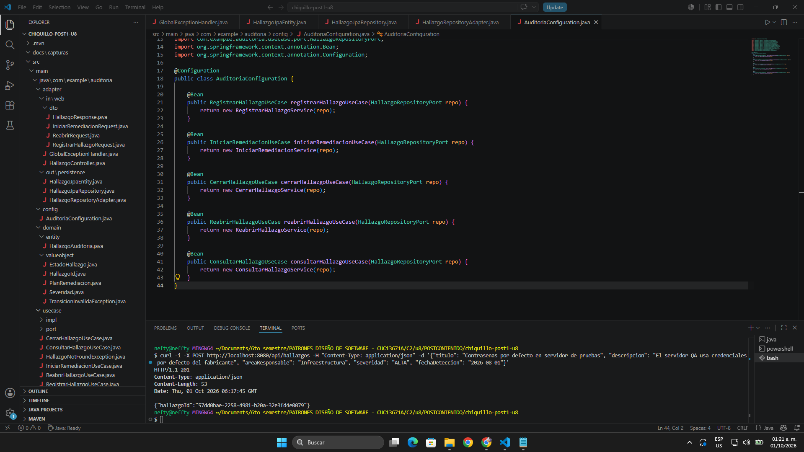
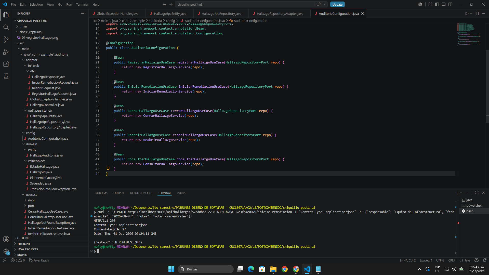
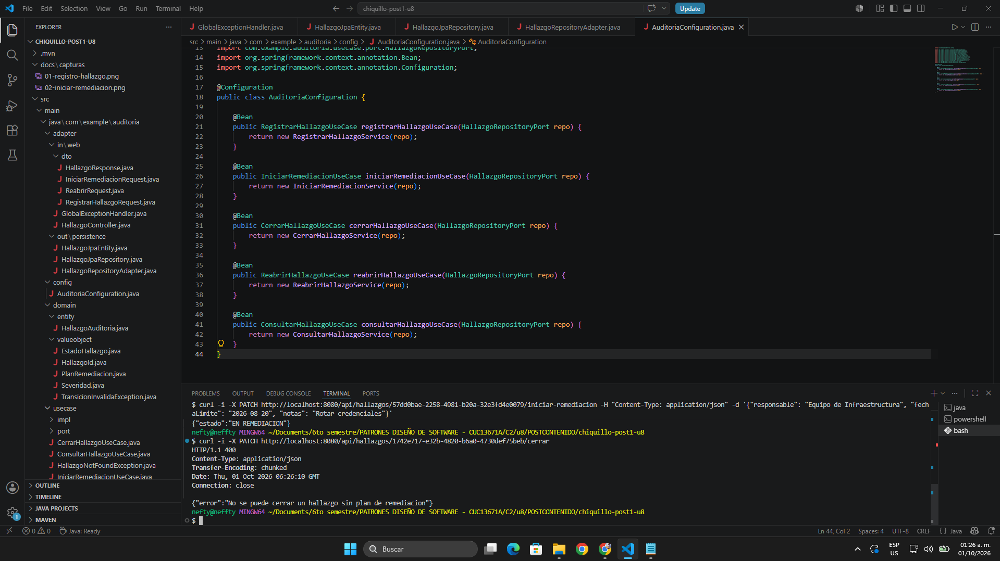
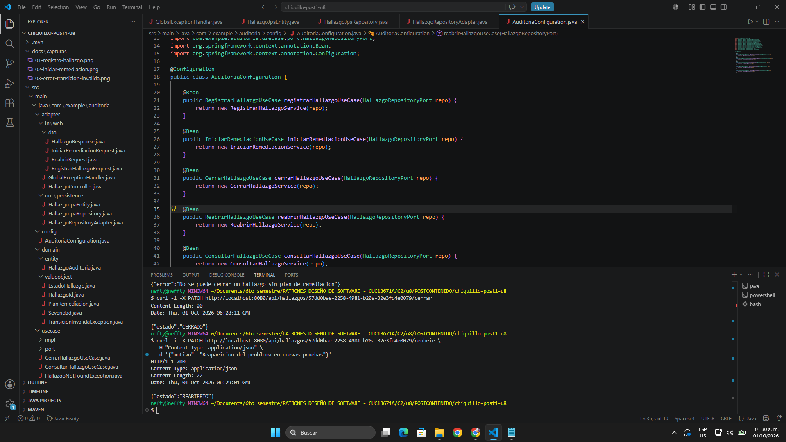
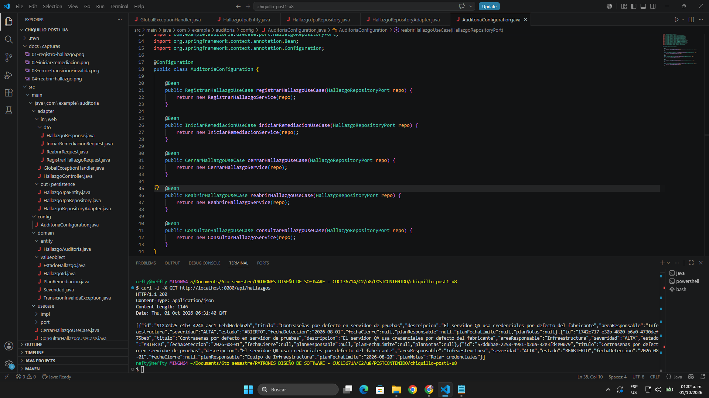

# Post-contenido — Unidad 8: Patrones Arquitectónicos II

## Descripción
Repositorio del post-contenido de la Unidad 8 de Patrones de Diseño de Software — Sexto Semestre. Sistema de seguimiento de hallazgos de auditoría interna implementado con Clean Architecture en un proyecto Spring Boot.

## Parte 1 — Clean Architecture (Hallazgos de Auditoría Interna)
El proyecto organiza el código en los cuatro círculos concéntricos de Clean Architecture. La dependencia del código siempre apunta hacia adentro, hacia `domain/`.

- **Entities (`domain/`):** reglas de negocio en Java puro, sin imports de frameworks. Contiene el Aggregate Root `HallazgoAuditoria`, los Value Objects `HallazgoId` y `PlanRemediacion`, los enums `Severidad` y `EstadoHallazgo` (con la máquina de estados) y la excepción `TransicionInvalidaException`.
- **Use Cases (`usecase/`):** casos de uso en Java puro. Contiene las interfaces de los casos de uso, sus implementaciones en `impl/` y el puerto de salida `HallazgoRepositoryPort` en `port/`.
- **Interface Adapters (`adapter/`):** `HallazgoController` y sus DTOs en `in/web/` traducen HTTP a llamadas de los casos de uso; `HallazgoRepositoryAdapter` en `out/persistence/` traduce entre el dominio y la entidad JPA `HallazgoJpaEntity`.
- **Frameworks & Drivers (`config/`):** Spring Boot, JPA y H2. `AuditoriaConfiguration` crea e inyecta los casos de uso de forma explícita.

### Estructura de paquetes
```text
chiquillo-post1-u8/
├── pom.xml
└── src/
    ├── main/
    │   ├── java/com/example/auditoria/
    │   │   ├── domain/
    │   │   │   ├── entity/
    │   │   │   │   └── HallazgoAuditoria.java
    │   │   │   └── valueobject/
    │   │   │       ├── EstadoHallazgo.java
    │   │   │       ├── HallazgoId.java
    │   │   │       ├── PlanRemediacion.java
    │   │   │       ├── Severidad.java
    │   │   │       └── TransicionInvalidaException.java
    │   │   ├── usecase/
    │   │   │   ├── CerrarHallazgoUseCase.java
    │   │   │   ├── ConsultarHallazgoUseCase.java
    │   │   │   ├── HallazgoNotFoundException.java
    │   │   │   ├── IniciarRemediacionUseCase.java
    │   │   │   ├── ReabrirHallazgoUseCase.java
    │   │   │   ├── RegistrarHallazgoUseCase.java
    │   │   │   ├── port/
    │   │   │   │   └── HallazgoRepositoryPort.java
    │   │   │   └── impl/
    │   │   │       ├── CerrarHallazgoService.java
    │   │   │       ├── ConsultarHallazgoService.java
    │   │   │       ├── IniciarRemediacionService.java
    │   │   │       ├── ReabrirHallazgoService.java
    │   │   │       └── RegistrarHallazgoService.java
    │   │   ├── adapter/
    │   │   │   ├── in/web/
    │   │   │   │   ├── HallazgoController.java
    │   │   │   │   └── dto/
    │   │   │   │       ├── HallazgoResponse.java
    │   │   │   │       ├── IniciarRemediacionRequest.java
    │   │   │   │       ├── ReabrirRequest.java
    │   │   │   │       └── RegistrarHallazgoRequest.java
    │   │   │   └── out/persistence/
    │   │   │       ├── HallazgoJpaEntity.java
    │   │   │       ├── HallazgoJpaRepository.java
    │   │   │       └── HallazgoRepositoryAdapter.java
    │   │   ├── config/
    │   │   │   └── AuditoriaConfiguration.java
    │   │   └── AuditoriaHallazgosApplication.java
    │   └── resources/
    │       ├── static/
    │       ├── templates/
    │       └── application.properties
    └── test/java/com/example/auditoria/
        ├── domain/entity/
        │   └── HallazgoAuditoriaTest.java
        └── AuditoriaHallazgosApplicationTests.java
```

## Decisiones de diseño
1. **Severidad como enum simple vs. EstadoHallazgo como enum con máquina de estados** — `Severidad` es solo una clasificación: ninguna severidad es "más válida" que otra y no tiene reglas propias, por eso se dejó como enum simple. `EstadoHallazgo` sí encapsula una regla de negocio real, que es qué transiciones son válidas, por eso tiene el método `puedeTransicionarA(...)`. Así la regla queda en el dominio, en un solo lugar, y no se repite en los controladores ni en los casos de uso.

2. **PlanRemediacion como Value Object embebido vs. agregado separado** — Según el criterio de límite de consistencia transaccional de los Agregados (Sección 3.3 de la guía), un agregado es una unidad atómica de consistencia controlada por su raíz. Un hallazgo no puede pasar a `EN_REMEDIACION` sin un plan válido ni cerrarse sin uno, y esa regla debe cumplirse en la misma transacción. Si el plan fuera un agregado separado podrían quedar ventanas de inconsistencia; al embeberlo en `HallazgoAuditoria`, la raíz valida y guarda el plan junto con el hallazgo.

## Cómo ejecutar
```
$ mvn clean test
$ mvn spring-boot:run
```

## Herramientas utilizadas
- Java 17, Spring Boot 4.1.1, Spring Data JPA, H2
- Apache Maven, curl, Git, GitHub

## Capturas de los endpoints
1. `POST /api/hallazgos` — registro de un hallazgo (201 Created)


2. `PATCH /api/hallazgos/{id}/iniciar-remediacion` — pasa a EN_REMEDIACION (200 OK)


3. `PATCH /api/hallazgos/{id}/cerrar` sobre un hallazgo ABIERTO — transición rechazada (400 Bad Request)


4. `PATCH /api/hallazgos/{id}/reabrir` sobre un hallazgo CERRADO — pasa a REABIERTO (200 OK)


5. `GET /api/hallazgos` — listado de hallazgos (200 OK)


## Conclusiones
Aplicar Clean Architecture permitió separar las reglas de negocio de los detalles técnicos, de modo que el dominio quedó en Java puro y se puede probar con JUnit sin levantar Spring Boot. Modelar la máquina de estados dentro de `EstadoHallazgo` evitó que las transiciones inválidas se validaran en varios lugares. Además, tratar `PlanRemediacion` como Value Object embebido garantizó que el hallazgo y su plan siempre se mantengan consistentes.